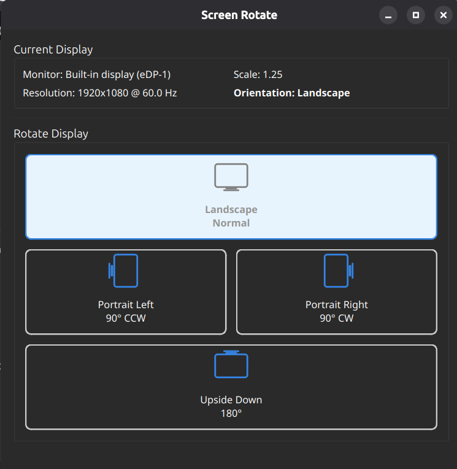

# Screen Rotate

A lightweight native desktop application for manually rotating the built-in display on **Ubuntu 26.04**, **GNOME 50**, and **Wayland**.

When GNOME's automatic screen rotation fails or is unavailable, Screen Rotate provides a simple and reliable manual alternative.

---

## Features

- 🖥️ Native PySide6 desktop application
- 🔄 Rotate the display with a single click
- 📱 Supports all four orientations
  - Landscape
  - Portrait Left
  - Portrait Right
  - Upside Down
- 🎯 Automatically detects the built-in display
- 💾 Preserves current resolution and display scale
- ⚡ Uses GNOME's official D-Bus DisplayConfig API
- 🚫 No `xrandr`, `wlr-randr`, or X11 dependencies

---

## Screenshots

### Main Window



---

## Requirements

- Ubuntu 26.04 LTS
- GNOME 50
- Wayland
- Python 3.10+
- PySide6
- dbus-python

---

## Installation

### Quick Install

```bash
chmod +x install.sh
./install.sh
```

### Manual Installation

Install the required packages:

```bash
pip3 install --user PySide6 dbus-python
```

Run the application:

```bash
python3 -m screen_rotate.main
```

### Ubuntu Packages

```bash
sudo apt install \
python3-pyside6.qtcore \
python3-pyside6.qtgui \
python3-pyside6.qtwidgets \
python3-dbus
```

---

## Usage

Launch the application from

- Activities → **Screen Rotate**

or

```bash
screen-rotate
```

Choose one of the four orientations.

The application displays:

- Current monitor
- Resolution
- Scale
- Active orientation

The current orientation button is automatically highlighted and disabled.

---

## Project Structure

```
manual_rotate/
│
├── screen_rotate/
│   ├── main.py
│   ├── gui.py
│   ├── display.py
│   ├── monitor.py
│   ├── dbus.py
│   └── icons/
│
├── screenshots/
├── install.sh
├── uninstall.sh
├── requirements.txt
├── README.md
├── LICENSE.md
└── AGENTS.md
```

---

## Architecture

The application communicates directly with GNOME Mutter using the official D-Bus interface:

- `GetCurrentState`
- `ApplyMonitorsConfig`

Workflow:

1. Discover the built-in display
2. Read the current monitor configuration
3. Preserve resolution and scaling
4. Apply only the requested rotation
5. Refresh the UI

---

## Troubleshooting

### Rotation does not work

Verify that you are using Wayland:

```bash
echo $XDG_SESSION_TYPE
```

Expected output:

```
wayland
```

---

### No built-in display detected

Inspect the DisplayConfig interface:

```bash
busctl introspect \
org.gnome.Mutter.DisplayConfig \
/org/gnome/Mutter/DisplayConfig
```

---

### Display configuration is rejected

Some desktop environments may restrict monitor configuration changes.

Verify that `ApplyMonitorsConfigAllowed` is enabled.

---

## Known Limitations

- Only rotates the built-in display
- External monitors are not rotated
- Wayland only
- GNOME Mutter DisplayConfig API required

---

## Uninstall

```bash
chmod +x uninstall.sh
./uninstall.sh
```

The uninstall script removes:

- Application files
- Desktop launcher
- Icons
- Command-line launcher

Installed Python packages are left untouched.

---

## License

This project is licensed under the MIT License.

See the [LICENSE](LICENSE) file for details.
